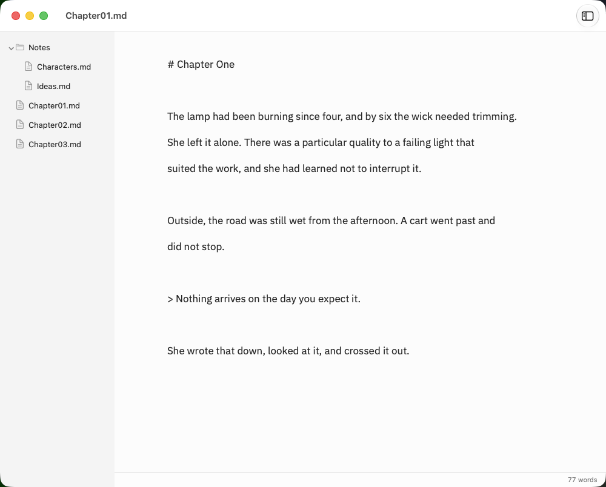
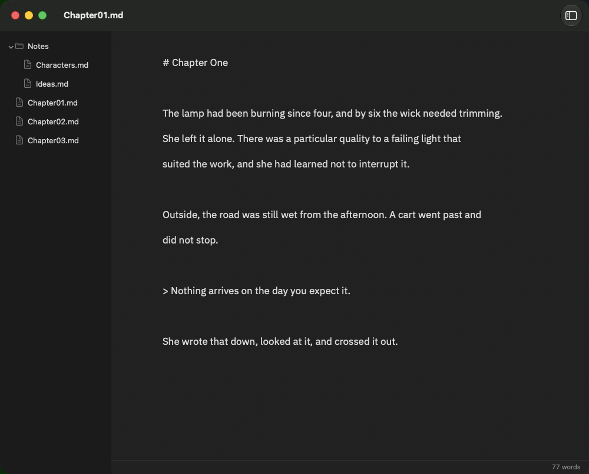
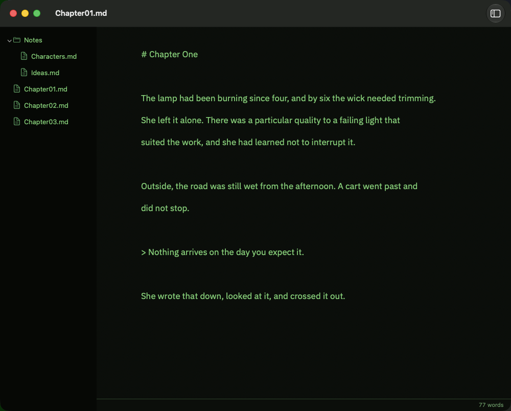
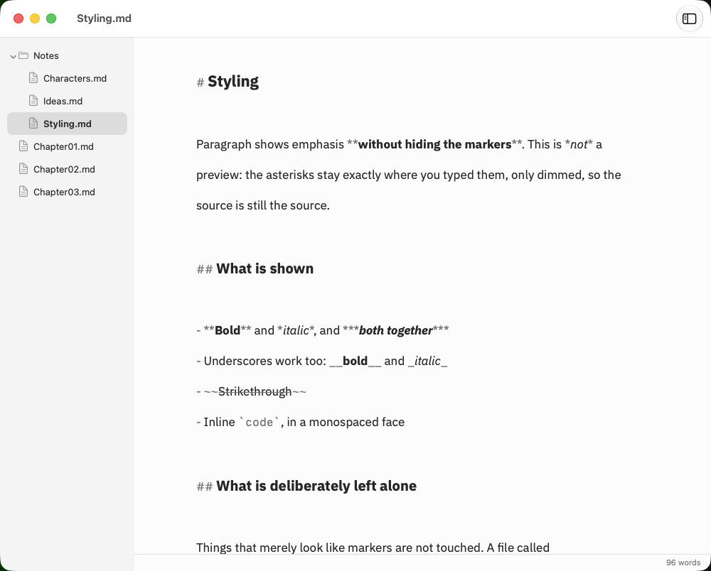
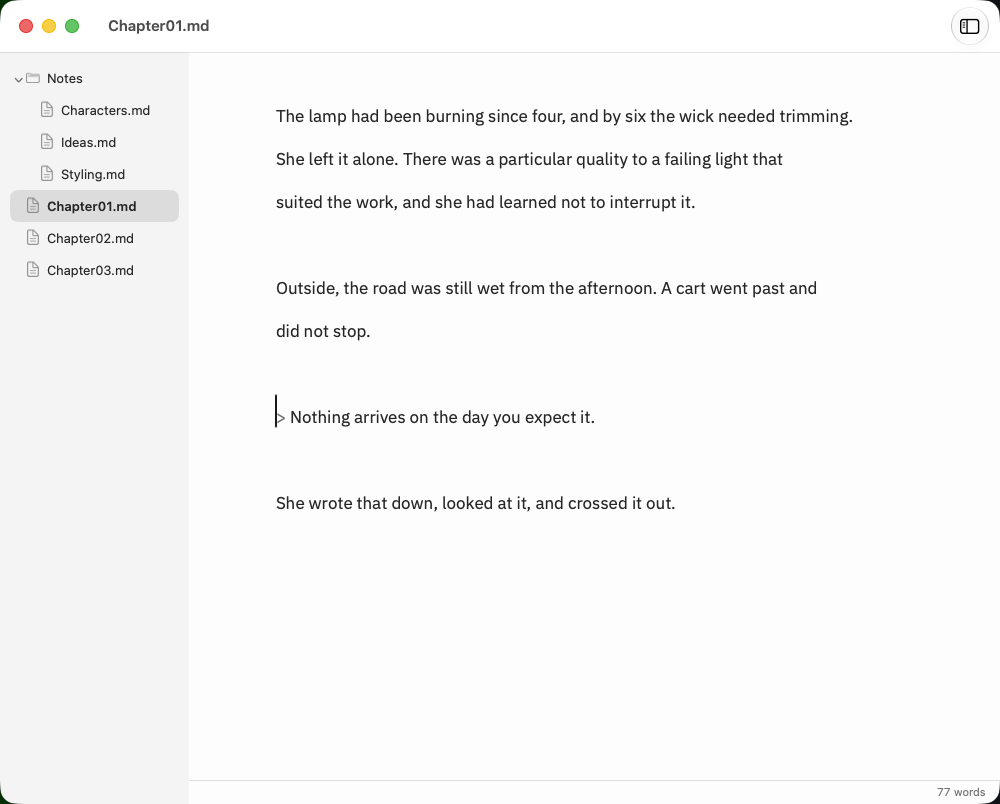
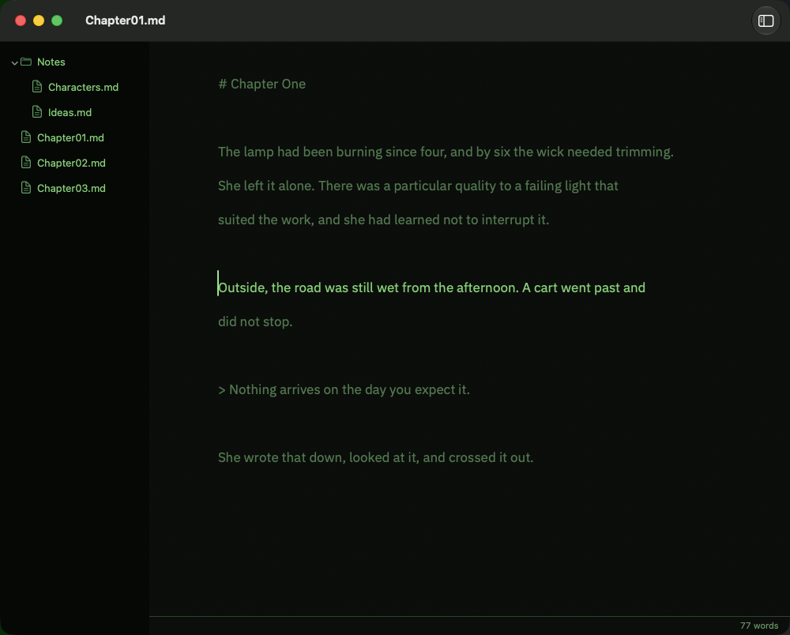
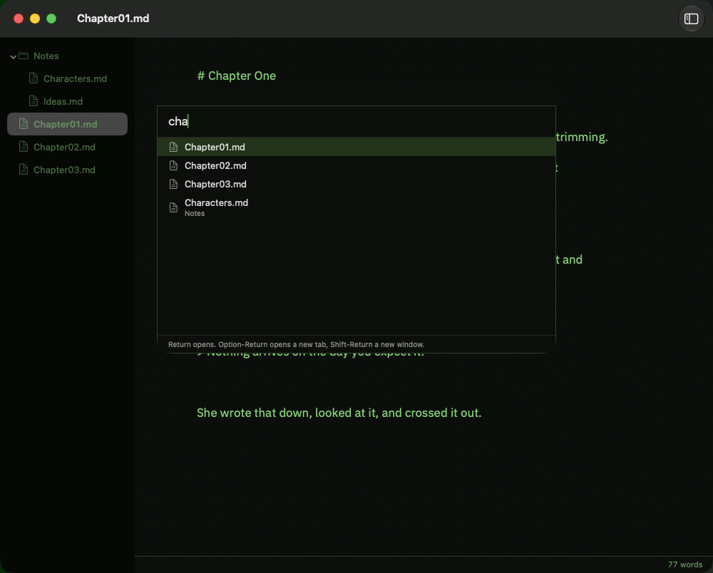
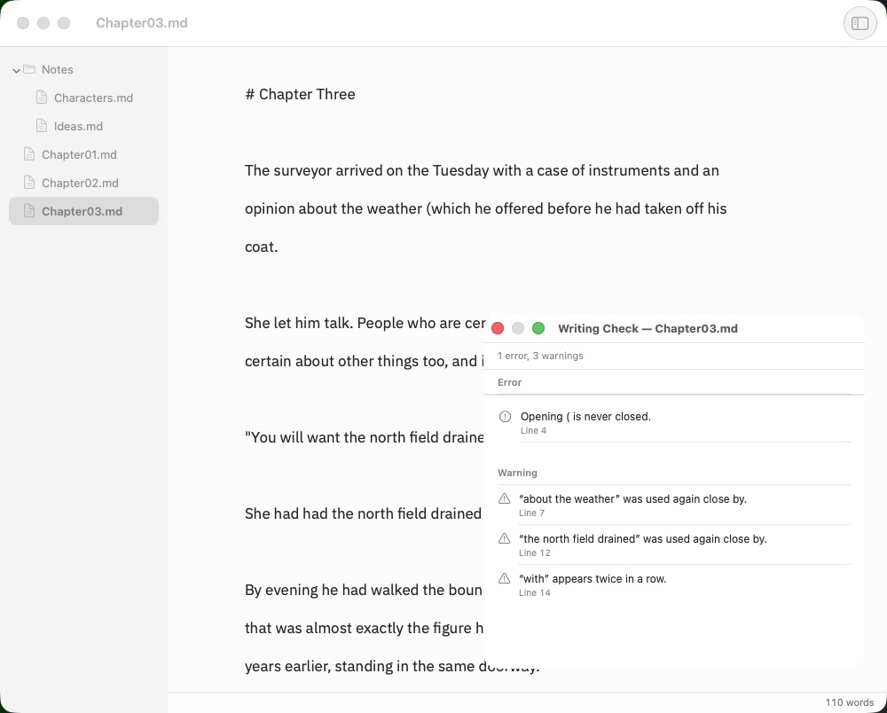

<p align="center">
  
</p>

<h1 align="center">Paragraph</h1>

<p align="center">
  A native macOS Markdown writing application focused on readability and distraction-free drafting. Paragraph opens a folder of ordinary Markdown files and gets out of the way — a centred writing column, three calm themes, Typewriter and Focus modes, and the current word count. Nothing else.
</p>

<p align="center"><strong>Requires macOS 13 (Ventura) or later. Apple Silicon and Intel.</strong></p>

<p align="center">
  <a href="https://github.com/pearcenuk/Paragraph/releases/latest">Download</a> ·
  <a href="https://github.com/pearcenuk/Paragraph/issues">Issues</a>
</p>

## About this project

Paragraph was written entirely with [Claude Code](https://claude.com/claude-code). I can't code in Swift — this is an experiment in describing the tool I wanted and having AI build it. It does what I need for my own writing, and I'm sharing it in case it's useful to others.

It's presented **as-is**: I may not be able to fix bugs beyond what I can describe to Claude, and it isn't notarized with Apple. Treat it accordingly — but the source is all here, MIT licensed, so fork away.

The guiding rule throughout was: **if a feature does not directly help the writer write or edit words, it does not belong in Paragraph.**



---

## Installing

Download the latest `Paragraph-x.x.zip` from [Releases](https://github.com/pearcenuk/Paragraph/releases), unzip it, and drag `Paragraph.app` into your Applications folder.

> **First launch:** Paragraph is not notarized by Apple, so macOS will block it the first time. Right-click `Paragraph.app` and choose **Open**, then confirm. If that option doesn't appear, go to **System Settings › Privacy & Security** and click **Open Anyway**. You only need to do this once.

Paragraph runs in Apple's App Sandbox and can only reach folders and files you choose yourself. It has no network access at all.

---

## Quick start

1. **File › Open Workspace Folder…** (`⌥⌘O`) and choose a folder of writing. Local, an external drive, or iCloud Drive.
2. Its `.md`, `.markdown` and `.txt` files appear in the browser on the left. Double-click one to open it.
3. Write.
4. `⌃⌘T` for **Typewriter Mode** — keeps the line you're on near the middle of the window.
5. `⌃⌘P` for **Focus Mode** — dims everything except the paragraph you're in.
6. `⇧⌘O` for **Quick Open** — type a few letters to jump to any file in the folder.
7. Quit whenever. Paragraph reopens with the same folder, windows, tabs and cursor positions.

Your files are ordinary Markdown throughout. Paragraph has no format of its own, no library and no database — delete it and you still have exactly the folder you started with.

---

## What it does

**Writing**

- A centred, left-aligned writing column with a fixed, comfortable measure of about 66 characters
- Prose set in IBM Plex Sans; `⌘+` and `⌘-` change the size, `⌘0` resets it
- Bold and italic are drawn as bold and italic, with the Markdown markers left in place
- The system's own spell checking, and no other analysis while you type
- The current document's word count, and no other statistic

**Getting around**

- A workspace browser you can drive entirely from the keyboard
- Native macOS tabs and windows — the same file in two windows is one document, not two copies
- Quick Open, scoped to the folder you chose
- The session comes back the way you left it

**Modes and themes**

- Typewriter Mode and Focus Mode
- Light, Dark and Green Screen themes
- Writing Check: a small set of mechanical checks you run deliberately

## What it deliberately does not do

No AI. No accounts, cloud service or subscription. No plugins, custom themes, CSS, font pickers or colour pickers. No writing goals, streaks, reading times, readability scores or style advice. No corkboard, no character database, no project planning. No Markdown preview, and no hidden-Markdown editor.

---

## Themes

Three, chosen and finished rather than configurable. Every colour is held to a contrast floor by the test suite: body text at 7:1 or better, and the text Focus Mode dims never below 3:1, so it stays readable rather than merely present.

| Light | Dark | Green Screen |
|---|---|---|
|  |  |  |

Green Screen is a dark room and green text, and nothing else: no scan lines, no bloom, no curvature, no flicker. Those would be decoration, and decoration is not writing.

## The workspace

A workspace is a folder and nothing more. Choose one and its Markdown and text files appear on the left, where you can navigate them entirely from the keyboard: `⌘1` moves focus there, arrow keys walk the tree, `↩` opens, and `Esc` hands focus back to the manuscript.

Double-clicking opens a file **in the tab you are already looking at**, the way an editor does. The tab it replaces is closed only if it holds nothing unsaved. Opening an *additional* tab is deliberate: middle-click, `⌥↩`, or the contextual menu.

There is no index, no metadata and no tags. It watches the folder, so files added, renamed or removed by Finder, another editor or iCloud Drive appear without a refresh. Choosing a different folder closes the old folder's documents, so the browser and the editor never disagree about where you are — asking first about anything unsaved.

## Markdown, shown but not hidden

Emphasis is drawn as emphasis — **bold** is bold, *italic* is italic — while the markers stay exactly where you typed them, dimmed. This is not a preview and not a hidden-Markdown editor: nothing moves, appears or disappears as the cursor travels over it.



The scanner is deliberately cautious, because a wrongly bolded half-paragraph is far more irritating than a missed italic. `some_file_name_here` stays upright, `2 * 3 * 4` is arithmetic, and nothing inside a code span or fenced block is touched.

## Typewriter Mode

Keeps the line you are writing near the middle of the window, so your eyes stay in one place instead of drifting to the bottom of the screen. `⌃⌘T`.



## Focus Mode

Keeps the paragraph you are in fully readable and quietly de-emphasises the rest. `⌃⌘P`. It never modifies the document — the dimming is drawn, not written — and spelling squiggles survive underneath it.



## Quick Open

`⇧⌘O` finds files in the workspace and nothing else. It is not a command palette, and it never looks outside the folder you chose.



## Writing Check

`⌃⌘R` runs a small set of mechanical checks, deliberately, the way you run a compiler. Results appear in their own window, nothing is changed for you, and no squiggle is ever left behind in the manuscript.



It reports unmatched quotation marks, parentheses and square brackets as errors, and consecutive duplicate words and closely repeated phrases as warnings. It knows that `don't` and `the boys' coats` contain apostrophes rather than quotes, that `had had` is grammatical, and that fiction re-opens a quotation mark on each paragraph of continued speech.

It says nothing about the quality of the writing, and it never will.

## Coming back

Quit with a workspace open and a few chapters in tabs, and that is what you return to: the same windows at the same size, the same tabs in the same order, the right one in front, the browser open with the folders you had expanded, and each document roughly where you left the cursor.

Restoration never takes priority over your files. A document that has moved or been deleted is named in a message offering to find it or drop it from the session — nothing is ever recreated to fill the gap. It can be turned off in Settings.

---

## Keyboard shortcuts

Every command is also in the menus; shortcuts are accelerators, not the only way to work. **Help › Keyboard Shortcuts** (`⌘/`) shows the current list.

| | |
|---|---|
| Open Workspace Folder… | `⌥⌘O` |
| Quick Open… | `⇧⌘O` |
| Show/Hide Workspace Browser | `⌥⌘S` |
| Move Focus to Workspace Browser | `⌘1` |
| Move Focus to Editor | `⌘2` |
| Open | `⌘↩` |
| Open in New Tab | `⌥⌘↩` |
| Open in New Window | `⇧⌘↩` |
| Show Next / Previous Tab | `⌃⇥` / `⌃⇧⇥` |
| Reopen Closed Tab | `⇧⌘T` |
| Bigger / Smaller text | `⌘+` / `⌘-` |
| Actual Size | `⌘0` |
| Typewriter Mode | `⌃⌘T` |
| Focus Mode | `⌃⌘P` |
| Show/Hide Word Count | `⌃⌘W` |
| Run Writing Check | `⌃⌘R` |
| Keyboard Shortcuts | `⌘/` |

New, Open, Save, Save As, Close, Print, Undo and Find keep their standard macOS keys. `⌘P` is left to Print, which is why Quick Open is `⇧⌘O`. `⌘0` belongs to Actual Size, which is why the panes are `⌘1` and `⌘2`.

## Your files

Paragraph works directly on your files and does not convert them. Reading records the text encoding, byte-order mark and line-ending style; writing restores all three. A file that mixes line-ending conventions is left exactly as found, because tidying it would be a change you did not ask for.

Opening a document can never write to it. The test suite checks this as a round trip: read a file, change nothing, write it back, and require the bytes to be identical.

Word counting removes Markdown markup first, so headings, bullets, emphasis markers, link destinations and code blocks contribute nothing; a link still contributes its visible text. `don't`, `well-known`, `U.S.A.` and `1,000` each count as one word.

---

## Building from source

1. Clone the repository.
2. Open `Paragraph.xcodeproj` in Xcode.
3. Select the **Paragraph** scheme and your Mac as the run destination.
4. Press **⌘R**.

Or from the command line:

```bash
xcodebuild -project Paragraph.xcodeproj -scheme Paragraph -configuration Release \
  -destination 'generic/platform=macOS' ONLY_ACTIVE_ARCH=NO build
```

The app is signed to run locally ("ad-hoc"), so it builds without a developer account.

### Testing

Pure logic — word counting, Writing Check, Markdown styling and file encoding — lives in a local Swift package with no dependency on the application, so it tests in under a second:

```bash
swift test --package-path ParagraphKit
```

Application behaviour is tested against the real objects:

```bash
xcodebuild -project Paragraph.xcodeproj -scheme Paragraph -configuration Debug test
```

Currently 101 package tests and 79 application tests, with no compiler warnings.

### Why macOS 13

Chosen to be as old as possible without forcing compatibility code into the application: Ventura still covers Intel Macs back to around 2017, Swift concurrency is native from macOS 12, and every SwiftUI API used is dependable on 13. There are no availability guards anywhere in the source, which is the check that the target was chosen honestly.

[`ARCHITECTURE.md`](ARCHITECTURE.md) explains why the document, window and tab layers are AppKit and what that buys.

---

## Known limitations

- Native window tabbing means each tab is really a window with its own browser; visibility is kept in step across a tab group so the group behaves like the single window it appears to be.
- Closing every window and then quitting brings those windows back next launch. Losing an arrangement of tabs would be the worse trade.
- Emphasis is matched within a line, so a phrase emphasised across a soft line break is not styled.
- No app notarization, so the first launch needs the right-click dance above.

## Licence

Paragraph is released under the [MIT License](LICENSE).

The bundled typeface, **IBM Plex Sans**, is © IBM Corp. and licensed separately under the SIL Open Font License 1.1. The application icon is a pilcrow set in the same typeface. See [THIRD-PARTY-NOTICES.md](THIRD-PARTY-NOTICES.md).
